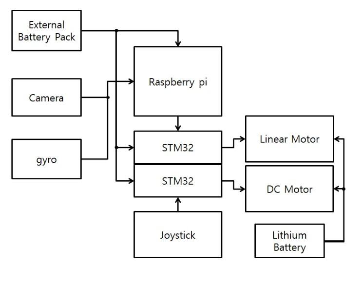
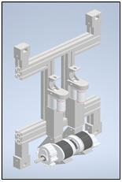
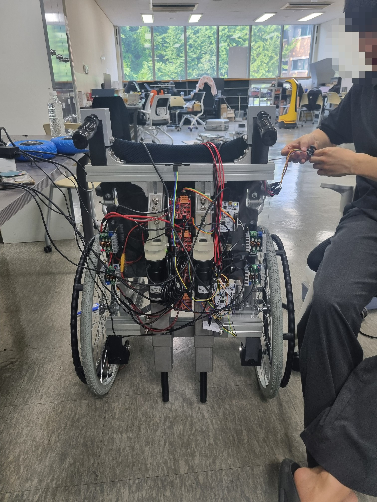

# 장애물 회피 균형 유지 휠체어 모듈

## 📌 프로젝트 개요

STM32F103RBT6 마이크로컨트롤러와 Raspberry Pi를 사용하여 조이스틱 입력을 기반으로 DC 모터를 제어하고, YOLO를 활용한 장애물 감지 및 자이로 센서를 통한 수평 유지 기능을 제공하는 임베디드 시스템입니다. 이 프로젝트는 기존의 수동 휠체어에 부착 가능한 로봇 모듈을 통해 저비용으로 전동 휠체어의 기능을 구현하며, 장애인의 자율성과 독립성을 높이는 것을 목표로 합니다.

---

## 🛠 사용된 하드웨어

- **MCU:** STM32F103RBT6
- **입력 장치:** 조이스틱 (ADC 사용)
- **모터 드라이버:** (사용된 모터 드라이버 명시 필요)
- **센서:**
  - **장애물 감지:** Raspberry Pi + YOLOv8 + 웹캠
  - **수평 유지:** 자이로 센서 (MPU 6050)
  - **장애물 감지용 GPIO 입력 핀:** (PB10, PB4)
- **통신:** UART (USART3, 115200 baud rate), I2C (Raspberry Pi와 자이로 센서)

---

## 🏗 프로젝트 구조

```plaintext
JoystickMotor/
├── Core/                # 핵심 소스 코드
├── Drivers/             # 하드웨어 드라이버
├── .cproject            # 개발 환경 설정 파일
├── .project             # 프로젝트 설정 파일
├── main.c               # 메인 코드 (모터 제어, ADC 읽기, 장애물 감지 등)
├── STM32F103RBTX_FLASH.ld  # 링커 스크립트
├── TryMotorJoystick.ioc  # STM32CubeMX 설정 파일
└── README.md            # 프로젝트 설명 파일
```

---

## ⚙️ 주요 기능

1. **조이스틱 입력을 기반으로 모터 제어**

   - ADC를 사용하여 조이스틱의 X, Y 축 값을 읽음
   - X축(전진/후진), Y축(좌회전/우회전) 제어
   - PWM을 활용하여 부드러운 속도 조절 가능

2. **YOLOv8을 이용한 장애물 감지 및 자동 정지**

   - Raspberry Pi와 웹캠을 활용하여 실시간 객체 감지
   - YOLOv8 모델을 통해 장애물 감지 시 모터 동작 차단

3. **자이로 센서를 통한 자동 수평 유지**

   - MPU 6050 자이로 센서를 이용하여 휠체어의 수평 유지
   - UART 통신을 통해 STM32에 각도 데이터를 전송하여 리니어 모터 제어

4. **버튼을 이용한 조이스틱 활성화/비활성화**

   - GPIO 입력 핀(A0)을 사용하여 버튼 클릭 시 조이스틱 활성화/비활성화 토글

5. **UART 디버깅 (USART3)**

   - `printf`를 통해 실시간으로 센서 값 및 상태 확인 가능

---

## 📷 시스템 이미지

### 1. 시스템 다이어그램


### 2. 하드웨어 설계 이미지


### 3. 완성된 휠체어 로봇


---

---

## 🚀 향후 개선 사항

1. **PWM 속도 조절 기능 추가**

   - 현재 `updateDutyCycle()` 함수가 주석 처리되어 있음
   - `adcValue`를 기반으로 동적 속도 조절 기능 추가 가능

2. **장애물 감지 알고리즘 개선**

   - YOLO를 통한 단순 감지에서 객체의 크기, 거리, 이동 방향까지 분석

3. **수평 유지 기능 강화**

   - 스테레오 비전 또는 깊이 센서를 추가하여 거리 감지 정확도 향상

4. **UART 디버깅 메시지 추가**

   - `printf()`를 활용한 ADC 값 및 장애물 감지 정보 출력

---

## 📜 라이선스

이 프로젝트는 STMicroelectronics의 STM32 HAL 라이브러리를 사용하며, **LICENSE 파일**을 확인하세요.

---

## 💬 문의

궁금한 사항이나 개선 제안이 있다면 이슈를 남겨주세요!

