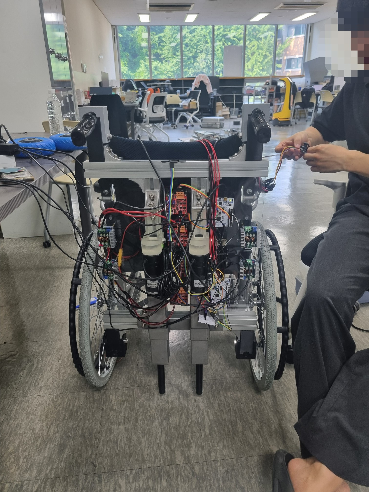
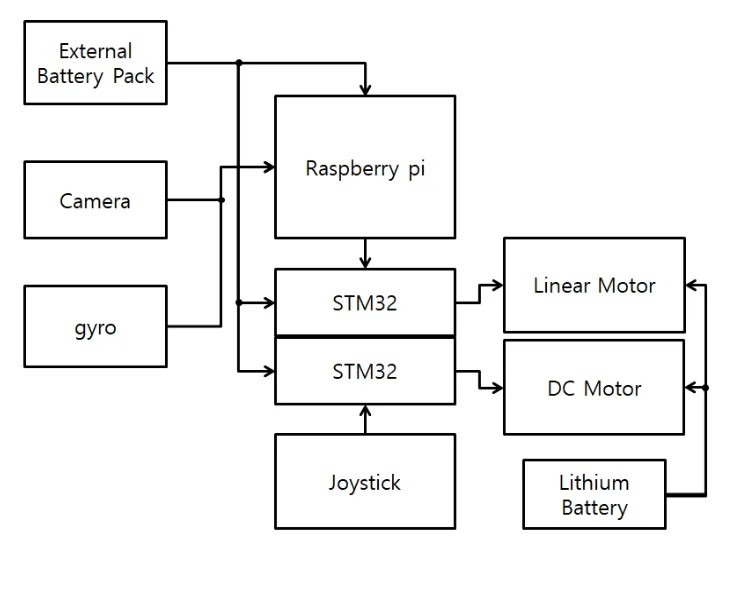
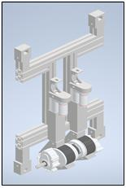

# Obstacle Avoidance Wheelchair

> STM32와 Raspberry Pi를 결합해 장애물 감지와 자세 보정 기능을 제공하는 휠체어 전동 보조 모듈

기존 수동 휠체어에 부착할 수 있는 전동 보조 시스템을 설계하고 구현했습니다. 조이스틱 기반 주행, YOLOv8 기반 장애물 감지, MPU6050 기반 수평 유지 기능을 하나의 시스템으로 통합해 사용자의 조작 편의성과 주행 안전성을 높이는 것을 목표로 했습니다.



## 프로젝트 요약

| 구분 | 내용 |
| --- | --- |
| 핵심 기능 | 조이스틱 주행, 장애물 감지 및 정지, 자세 측정 및 수평 유지 |
| 제어기 | STM32F103RBT6 |
| 엣지 컴퓨팅 | Raspberry Pi, YOLOv8, 웹캠 |
| 센서 | 조이스틱, MPU6050 |
| 통신 | GPIO, UART, I2C |
| 개발 환경 | STM32CubeMX, STM32CubeIDE, C, Python |

## 담당 역할

- STM32CubeMX를 이용한 ADC, GPIO, PWM Timer, USART 주변장치 설정
- 조이스틱 입력에 따른 전진, 후진, 좌회전, 우회전 모터 제어 로직 구현
- 조이스틱과 자이로 센서 데이터에 이동평균필터를 적용해 순간 노이즈와 출력 흔들림 완화
- Raspberry Pi의 장애물 감지 결과와 STM32 모터 제어부를 GPIO 신호로 연동
- MPU6050 자세 데이터와 리니어 모터를 이용한 수평 유지 기능 구성
- 하드웨어 회로 구성과 센서값 및 주행 상태 디버깅

## 시스템 구성

```text
Joystick --ADC--> STM32F103RBT6 --GPIO/PWM--> Left/Right DC Motor
                         ^
                         |
Webcam --> Raspberry Pi + YOLOv8 --GPIO(PB10, PB4)

MPU6050 --I2C--> Raspberry Pi --UART--> STM32 --> Linear Actuator
```



## 핵심 구현

### 1. 조이스틱 기반 주행 제어

- ADC1의 두 채널로 조이스틱 X/Y축 값을 읽어 주행 방향을 판별했습니다.
- 중앙 구간에 데드존을 두어 조이스틱이 중립 상태일 때 모터가 오동작하지 않도록 했습니다.
- 이동평균필터로 ADC 값의 순간 변동을 완화하고, GPIO 방향 신호와 PWM Timer를 이용해 좌우 모터를 제어했습니다.
- PA0 버튼으로 조이스틱 제어를 활성화하거나 비활성화할 수 있도록 구성했습니다.

### 2. YOLOv8 기반 장애물 감지

- Raspberry Pi와 웹캠에서 YOLOv8을 실행해 전방 및 후방 장애물을 감지했습니다.
- 감지 결과를 PB10/PB4 GPIO 입력으로 전달하고, 진행 방향에 장애물이 있으면 STM32가 모터 출력을 차단하도록 했습니다.
- 영상 인식과 실시간 모터 제어를 분리해 Raspberry Pi는 인식, STM32는 구동과 안전 정지를 담당하도록 구성했습니다.

### 3. 자이로 기반 수평 유지

- MPU6050에서 측정한 자세 데이터에 이동평균필터를 적용해 진동과 순간 측정 오차를 줄였습니다.
- 필터링된 기울기 정보를 STM32에 전달하고, 리니어 모터를 제어해 경사면에서도 좌석의 수평을 유지하도록 설계했습니다.
- USART3 디버깅을 통해 센서값과 시스템 상태를 실시간으로 확인할 수 있도록 했습니다.

### 4. 안전 중심 제어

- 조이스틱 비활성화 또는 입력 오류 시 모터 방향 출력을 즉시 초기화합니다.
- 장애물 감지 신호와 사용자의 진행 방향을 함께 판단해 필요한 방향의 이동만 차단합니다.
- 인식부와 구동부를 분리해 영상 처리 지연이 모터 제어 주기를 직접 방해하지 않도록 했습니다.

## 하드웨어



| STM32 핀/주변장치 | 용도 |
| --- | --- |
| ADC1 IN10, IN11 | 조이스틱 X/Y축 입력 |
| TIM2 CH2, TIM3 CH2 | 좌우 모터 PWM 출력 |
| PB10, PB4 | Raspberry Pi 장애물 감지 신호 입력 |
| PA0 | 조이스틱 활성화 버튼 |
| USART3 | 센서 및 상태 디버깅 |

## 프로젝트 구조

```text
ObstacleAvoidanceWheelchair/
├── Core/
│   ├── Inc/                    # 헤더 및 HAL 설정
│   ├── Src/main.c             # 조이스틱, 장애물 신호, 모터 제어
│   └── Startup/               # STM32 시작 코드
├── Drivers/                   # CMSIS 및 STM32 HAL 드라이버
├── Image/                     # 시스템 및 하드웨어 이미지
├── TryMotorJoystick.ioc       # STM32CubeMX 설정
└── README.md
```

## 개발 환경

1. STM32CubeIDE에서 프로젝트를 불러옵니다.
2. `TryMotorJoystick.ioc`에서 핀과 주변장치 설정을 확인합니다.
3. 보드 연결 후 펌웨어를 빌드하고 STM32F103RBT6에 업로드합니다.
4. USART3를 `115200 baud`로 연결해 동작 상태를 확인합니다.

> 이 저장소에는 STM32 제어 펌웨어가 포함되어 있습니다. Raspberry Pi의 YOLOv8 추론 및 MPU6050 데이터 수집 코드는 전체 시스템에서 별도 모듈로 운용했습니다.

## V-모델 개발 프로세스

요구사항 분석부터 시스템·소프트웨어 설계, 단위 검증, 인터페이스 시험과 시스템 검증까지 산출물을 연결했습니다. 각 요구사항 ID는 설계 요소, 구현 파일과 시험 ID에 양방향으로 추적됩니다.

| 왼쪽 개발 단계 | 오른쪽 검증 단계 |
| --- | --- |
| 사용자 요구사항 | 사용자 시나리오 기반 시스템 검증 |
| 시스템 요구사항 | STM32·Raspberry Pi·모터 통합 시험 |
| 시스템/소프트웨어 아키텍처 | ADC·GPIO·PWM·UART 인터페이스 시험 |
| 상세 설계와 구현 | 필터·데드존·안전 인터록 단위 검증 |

- [V-모델 개요](docs/v-model/README.md)
- [요구사항 명세](docs/v-model/requirements.md)
- [아키텍처](docs/v-model/architecture.md)
- [검증 및 확인](docs/v-model/verification-validation.md)
- [추적성 매트릭스](docs/v-model/traceability-matrix.md)
- [형상·변경·문제관리](docs/v-model/supporting-processes.md)

## 성과

- 수동 휠체어를 전동화할 수 있는 부착형 모듈 구조를 구현했습니다.
- 임베디드 모터 제어, 센서 필터링, 영상 인식 기반 안전 정지를 하나의 시스템으로 통합했습니다.
- 노이즈가 포함된 입력과 외부 장애물 신호를 고려해 안전한 정지 로직의 중요성을 확인했습니다.
